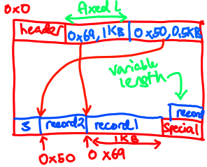
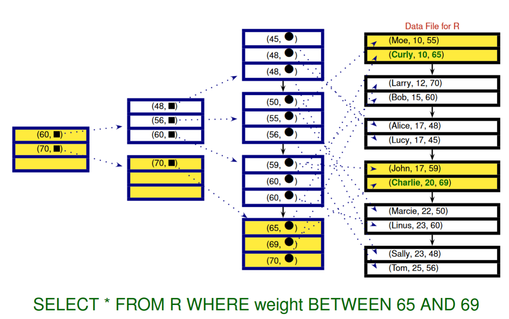
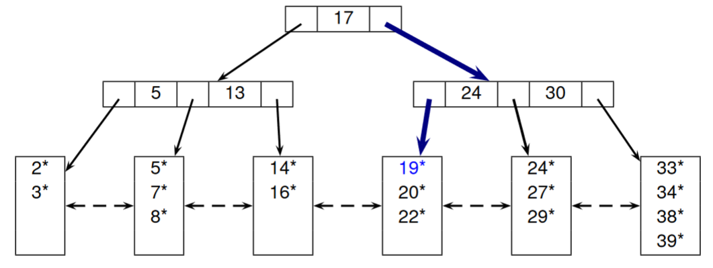
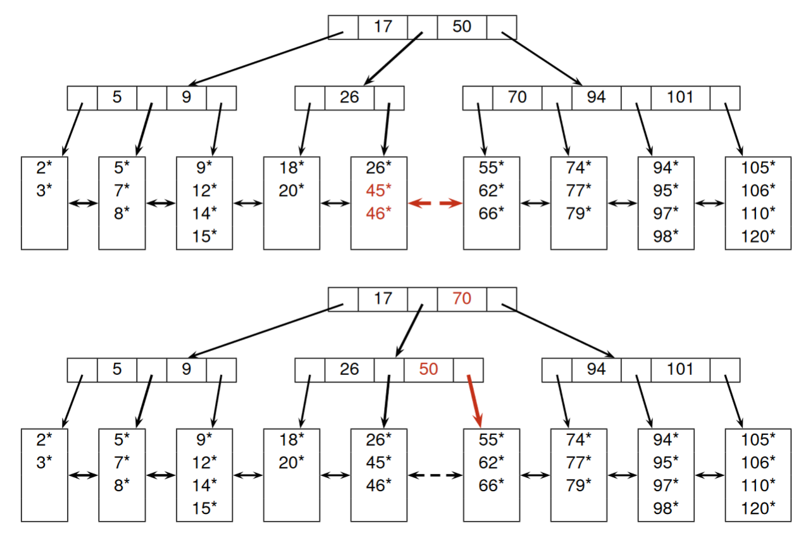

# CS3223

## Memory (Week 1)

### Memory hierachy (capacity, latency)

1. Registers (1KB, 0.3ns)
2. L1 cache (64KB, 1ns)
3. L2 cache (256KB, 3ns)
4. L3 cacge (2 - 4MB, 10ns)
5. dynamic RAM (4 - 64GB, 50 - 100 ns)
6. Disk (4 - 16 TB, 5 - 10 ms)

registers are 0.3ns, each level up x 3, memory 50 ns, disk 5 ms

### Access time
- command processing: parse SQL (considered negligible)
- seek time: move arms (perpendicular to disk) to correct track (5 - 6 ms)
- rotational delay: rotate track to correct block (average 1/2 rotion per access, depends on RPM)
- transfer time: move data to and from disk (move huge amounts of data = longer)
- **Disk access time** = seek + rotational + transfer
- **Disk access response time** = disk access time + queue delay

HDD avg sector transfer 100-200 microseconds, SSD 20-100 microseconds

### DBMS buffer pool

Buffer pool = cache of a DBMS, split into `frames` (block sized pages).
- client can request for a disk page to be fetched into pool or release a page from pool
- frames store s `pin count` and `dirty flag`. pin count == how many clients using, dirty == if it has been updated.
- frame can only be released in pin count is 0

Other than LRU, FIFO, MRU, Also have clock for page replacement policy. Basically a 1 chance round robin. 
circular array of frames, skip frame if pin count > 0, change referenced bit to false if pin 0 and bit is on, take page if pin 0 and bit off.
Turn reference bit on when pin count decrement to 0.

### File implementation
- Each record has an id called RID (page id + slot number). 1 page many slots.
- files organized as:
  1. Heap file, unordered. 
    1. page header store 2 linked lists of **pages**, 1 for free space, 1 for used.
    2. page directory has map to each data page.
  2. Sorted file, ordered by search key
  3. Hashed File, located in blocks by hash function

**Within a page**, fixed length records:
- packed: store records in contiguous slots, header stores number of records (slots).
- unpacked: use bit array to indicate if slot if full, can choose any slots.

Variable length records:

- offset of nth item stored at `H + n * L`, where `H` = Header size, `L` = size of pointer (offset + length)

## Indexing (Week 2)

- Indexes: data structures to speed up information retrieval
- Search key: sequence of 1 or more data attributes. Composite search key = at least 2 attributes. Unique index means search key is candidate key.
- Index stored as sorted index file. e.g. table `Weights(name, weight)`, index by weight `Index(weight, ptr_to_Weights_record)`. Can add more layers for efficiency

Tree based b+ tree indexing

- note that leaf nodes can store different formats:
    1. (weight, actual_record)
    2. (weight, record_id)
    3. (weight, record_id_array)
- Also has hashed based indexing, access by hash function.

### b+ tree operations

- non leaf nodes are not values: `[5]->[4][7]`, `5` __does not exist as a record__.
- order `x` b+ tree means nodes contain at least `x` nodes, at most `2x` nodes. (except root node, root at least 1 at most `2x`)
- Insert:
    1. if page not full, insert.
    2. if page full, check right neighbor. if not empty, redistribute. repeat for left if right full:
        1. take `2d` smallest records, store in page. rest in neighbor. update parent node.
        2. e.g. `[4]-->[1,3][4] + 2` &rarr; `[3] --> [1,2][3,4]`.
    3. split page:
        1. take `d` smallest records, store in page. `d+1` remaining records put in new leaf. add parent index as smallest of `d+1` leaf node
        2. if index node needs to split, `d` smallest indexes in 1 node, `d` largest indexes in 1 node. remaining 1 extra promote to higher depth.
        3. e.g. order 1: `[4,8]-->[1,2][4,5][8,9] + 10` &rarr; `[4,8,9]-->[1,2][4,5][8][9,10]` &rarr; `[8] --> ([4] --> [1,2][4,5]) ([9]-->[8][9,10])`.
- Deletion, underflow (node empty/ too little entries):
    1. page not underflow, ok.
    2. page underflow, check right neighbor size > `d`, redistribute 1 record (see insert). repeat for left.
    3. merge nodes:
        1. if neighbour size `d`, merge for `2d - 1` size. remove index in between.
        2. if index node underflow, merge. pull parent index key down
        3. e.g. order 2: 
            `[10] --> (other) ([20, 30] --> [10, 11][20, 21][30, 31]) delete 11` &rarr; 
            `[10] --> (other) ([30] --> [10, 20, 21][30, 31])` &rarr;
            `[other, 10, 30] --> [...other child][10, 20, 21][30, 31])` done.

    

---

- clustered index: order (i.e. sort order, not b tree order) of index is same or "similar" to actual order of records (in data storage). 
  Can only have 1 clustered index for each relation. e.g.: actual records sorted by id, clustered index = index on id
    - any index using format 1 (index, actual_record), is definitely clustered (since it stores the actual records)
- dense index: **index record** for every search key value exists. sparse index otherwise.
    - e.g. actual data `[1,2,3,4]` (in dlinked list), sparse index `[3] -> [1][3]`. To find 2 go to 1 and iterate `1 --> 2`. dense index `[3] -> [1,2][3,4]`.
    - sparse index relies on fact that data is sorted, so to find 2 you can iterate from 1 on the disk page.
    - unclustered index definitely dense, since data is not sorted in terms of search key, have to keep each search key as index record
